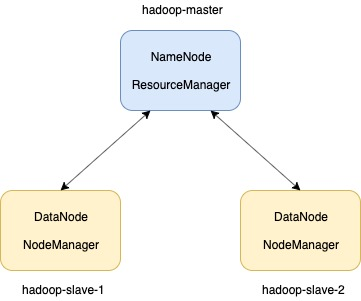

# Hadoop In Docker
This project is for anyone who wants to learn Apache Hadoop and needs to spawn a 3-node Apache Hadoop 3.2 cluster.

## Pre-Requisites

Please make sure that you have Docker fully setup in your machine. In case you are setting up Docker for the very first time, Follow this excellent first time setup documentations available at Docker Docs - 

The script used for finally spanning the cluster is a shell script, So only UNIX and LINUX based operating system are supported as of now. Sorry, Windows fella's, This one's not for you.

## Setup Instructions

The setup instructions are very easy-peasy, Infact there are just two :P -
* Clone the repository.
  * ``git clone https://github.com/Abhey/hadoop-in-docker.git``
* Execute the deploy_hadoop_in_docker script.
  * ``{PROJECT_ROOT_DIR}/deploy_hadoop_in_docker.sh``
  
Once you have executed the above two steps, You can confirm that your setup is complete by accesing the Web UI for HDFS and ResourceManager.

HDFS Web UI can be accessed at - localhost:9870
ResourceManager Web UI can be accessed at - localhost:8088

## Cluster Topology

The topology of cluster is quite intiutive, The spawned cluster has one master node namely hadoop-master which houses NameNode and ResourceManager processes. The reamaing two nodes of the cluster are slave nodes named hadoop-slave-1 and hadoop-slave-2 respectively, Both of theses nodes house DataNode and NodeManager processes.

## Feedback

Feel free to send us feedback on [Email](mailto:abhey.mnnit@gmail.com) or file an [Issue](https://github.com/Abhey/hadoop-in-docker/issues).

## Contributors

[Abhey Rana](https://github.com/Abhey)

## Contribute

* Feel free to report issues and bugs. It will be helpful for future releases of this application.
* Fork the repository and contribute, PR's are welcome.

## Acknowledgement

A special thanks to my team at SalesForce for motivating me to learn Hadoop, Which was the primal motivation for me to create this application.